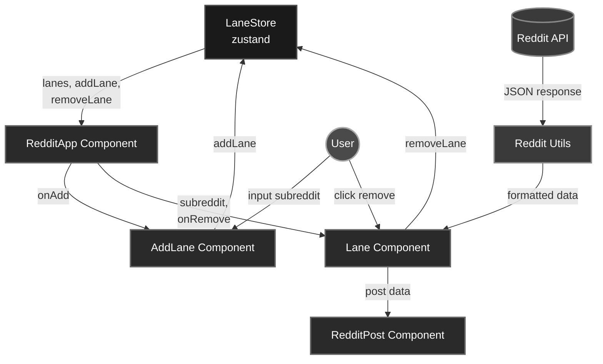

```mermaid
graph TD
    %% Store
    Store[LaneStore<br/>zustand]
    
    %% Main Components
    RedditApp[RedditApp Component]
    AddLane[AddLane Component]
    Lane[Lane Component]
    RedditPost[RedditPost Component]
    
    %% External Data
    Reddit[(Reddit API)]
    
    %% Utils
    Utils[Reddit Utils]
    
    %% Data Flow - Store
    Store -->|lanes, addLane,<br/>removeLane| RedditApp
    
    %% Data Flow - Components
    RedditApp -->|onAdd| AddLane
    RedditApp -->|subreddit,<br/>onRemove| Lane
    Lane -->|post data| RedditPost
    
    %% Data Flow - API
    Reddit -->|JSON response| Utils
    Utils -->|formatted data| Lane
    
    %% User Actions
    User((User)) -->|input subreddit| AddLane
    AddLane -->|addLane| Store
    User -->|click remove| Lane
    Lane -->|removeLane| Store
    
    %% Styling
    classDef component fill:#2a2a2a,stroke:#666,stroke-width:2px,color:#fff
    classDef store fill:#1a1a1a,stroke:#4a4a4a,stroke-width:2px,color:#fff
    classDef external fill:#3a3a3a,stroke:#888,stroke-width:2px,color:#fff
    classDef user fill:#4a4a4a,stroke:#aaa,stroke-width:2px,color:#fff
    
    class RedditApp,AddLane,Lane,RedditPost component
    class Store store
    class Reddit external
    class User user
    class Utils external
```